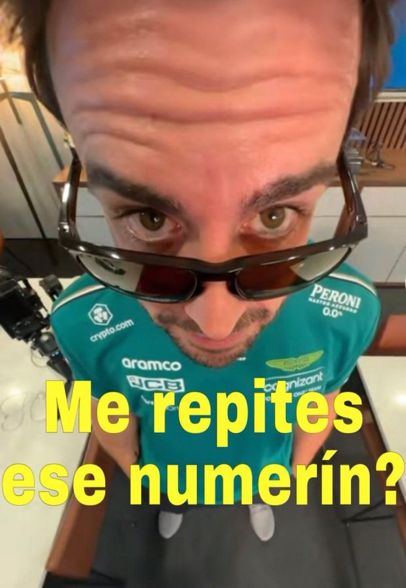

# Fernando AlonsBOT

## **¿Que es Fernando AlonsBOT?**

Fernando AlonsBOT es un bot de Discord creado a la raiz del meme de las especulaciones sobre la victoria numero 33 de Fernando Alonso en la Formula 1

## ¿Que hace?

Es muy simple, cuando hay un 33 en el Chat de Discord, automaticamente manda la siguiente imagen

<figure><figcaption><p>Meme de Fernando Alonso</p></figcaption></figure>


## Como crear tu propio Fernando Alonsbot

Necesitas una cuenta de desarrollador de Discord y crear una app, dentro de la app activas el Bot para que la app se comporte como un Bot, copias la clave de Discord que conecta con Python en la linea que luce como esta en la linea 23

```python
client.run("INSERT TOKEN HERE") #Token del bot (El Token va entre las comillas)
```
